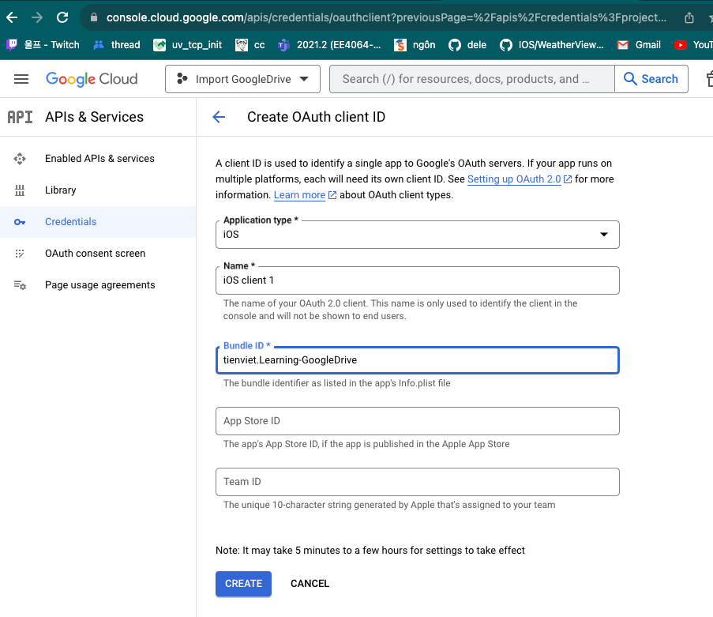
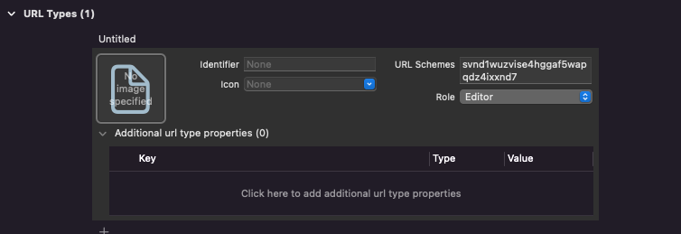
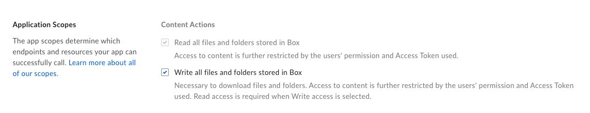

# learning-ImportBox

# I. Authorization

Sử dụng `OAuth 2.0`: `OAuth 2.0` sẽ yêu cầu ứng dụng chuyển hướng user tới browser để login vào Box.

# II. Create Application

Bước 0: Ta vào đây để xem file trong office chúng ta [Box](https://app.box.com/folder/0).

Ta sẽ create App thông qua [Console Box](https://app.box.com/developers/console). Ở đây ta có thể Create New App hoặc sử dụng 1 App đã được khởi tạo rồi.

Khi khởi tạo xong 1 App ở `Console Box`, ta để ý 3 thông tin này:
- Client ID: 
VD: `svnd1wuzvise4hggaf5wapqdz4ixxnd7`
- Client Secret:
VD: `svnd1wuzvise4hggaf5wapqdz4ixxnd7`
- Redirect URIs
VD: `boxsdk-svnd1wuzvise4hggaf5wapqdz4ixxnd7://boxsdkoauth2redirect`

Ta chú ý rằng: Ở phần `Redirect URIs` thì ta phải thay thế phần `CLIENT ID` trong  `boxsdk-<<YOUR CLIENT ID>>://boxsdkoauth2redirect` với `Client ID` ở trên. Như ở ví dụ trên, khi thay thế ta được `boxsdk-svnd1wuzvise4hggaf5wapqdz4ixxnd7://boxsdkoauth2redirect`



# III. Login Box IOS

- Import CocoaPod:

```swift
pod 'BoxSDK', '~> 5.0'
```

- Add `CLIENT ID` vào `URL Types` trong `Info.plist`



- Login và Logout:

```swift
import UIKit
import BoxSDK
import AuthenticationServices
import AuthenticationServices

class ViewController: UIViewController, ASWebAuthenticationPresentationContextProviding {

    func presentationAnchor(for session: ASWebAuthenticationSession) -> ASPresentationAnchor {
        self.view.window ?? ASPresentationAnchor()
    }
    
    //MARK: - Properties
    let sdk = BoxSDK(clientId: "svnd1wuzvise4hggaf5wapqdz4ixxnd7",
                     clientSecret: "mJTYcV07W9hCJg4D3xAUcns59piYaaFU")
    var client: BoxClient!
    
    //MARK: - UIComponent
    private lazy var loginButton: UIButton = {
        let button = UIButton(type: .system)
        button.setTitle("Log In", for: .normal)
        button.tintColor = .black
        button.addTarget(self, action: #selector(handleLoginhButtonTapped), for: .touchUpInside)
        return button
    }()
    
    private lazy var logoutButton: UIButton = {
        let button = UIButton(type: .system)
        button.setTitle("Log Out", for: .normal)
        button.tintColor = .black
        button.addTarget(self, action: #selector(handleLogoutButtonTapped), for: .touchUpInside)
        return button
    }()
    
    @objc func handleLoginhButtonTapped() {
        sdk.getOAuth2Client(tokenStore: KeychainTokenStore(), context: self) { result in
            switch result {
            case let .success(client):
                self.client = client
    
                self.client.users.getCurrent(fields: ["name", "login"]) { (result: Result<User, BoxSDKError>) in
                    switch result {
                    case .success(let user):
                        print("DEBUG: \(String(describing: user.name)) and \(String(describing: user.login))")
                    case .failure(let error) :
                        print("DEBUG: \(error.localizedDescription)")
                    }
                }

            case let .failure(error):
                print("DEBUG: \(error.message)")
            }
        }
    }
    
    @objc func handleLogoutButtonTapped() {
        client.destroy() { result in
            guard case .success = result else {
                print("Tokens could not be revoked!")
                return
            }

            print("Tokens were successfully revoked")
        }
    }
    
    
    //MARK: - View Lifecycle
    override func viewDidLoad() {
        super.viewDidLoad()
        
        configureUI()
    }
    
    func configureUI() {
        view.backgroundColor = .red
        view.addSubview(loginButton)
        view.addSubview(logoutButton)
        
        loginButton.frame = .init(x: 100, y: 200, width: 100, height: 50)
        logoutButton.frame = .init(x: 100, y: 300, width: 100, height: 50)
    }
    
}
```

- Ta chú ý rằng: Login là `async` và ta lấy thông tin của current user thông qua đoạn code:

```swift
self.client.users.getCurrent(fields: ["name", "login"]) { (result: Result<User, BoxSDKError>) in
        switch result {
        case .success(let user):
            print("DEBUG: \(String(describing: user.name)) and \(String(describing: user.login))")
        case .failure(let error) :
            print("DEBUG: \(error.localizedDescription)")
        }
}
```

# IV. Search and List file in Box

Ở đây tôi chỉ trình bày cách list ở folder root có id = 0

- List file 

```swift
func listFile() {
    let iterator = client.folders.listItems(folderId: "0", marker: "ile_extensions=png" ,sort: .name, direction: .ascending)
    iterator.next { results in
        switch results {
        case let .success(page):
            for item in page.entries {
                switch item {
                case let .file(file):
                    print("DEBUG: File \(String(describing: file.name)) (ID: \(file.id)) is in the folder")
                case let .folder(folder):
                    print("DEBUG: Subfolder \(String(describing: folder.name)) (ID: \(folder.id)) is in the folder")
                case let .webLink(webLink):
                    print("DEBUG: Web link \(String(describing: webLink.name)) (ID: \(webLink.id)) is in the folder")
                }
            }

        case let .failure(error):
            print("DEBUG: \(error.localizedDescription)")
        }
    }

}
```

- Search: Ở đây ta search file png hoặc HEIC, ta có thể query, hoặc `AND`, `OR`,... như ở trong [docs search](https://developer.box.com/reference/get-search/)

```swift
client.search.query(query: "png OR HEIC", fileExtensions: ["png, HEIC"]).next { result in
    switch result {
    case .success(let page):
        print("DEBUG: \(page.entries.count)")
        for item in page.entries {
                switch item {
                case let .file(file):
                    print("DEBUG: File \(file.name) (ID: \(file.id))")
                case let .folder(folder):
                    print("DEBUG: Folder \(folder.name) (ID: \(folder.id))")
                case let .webLink(webLink):
                    print("DEBUG: Web Link \(webLink.name) (ID: \(webLink.id))")
                }
            }
    case .failure(let error) :
        print("DEBUG: \(error.message)")
    }
}
```

# IV. Download File

Để có thể download  được 1 file, make sure chúng ta enable 2 phần sau:



```swift
func downloadFile(fileId: String) {
    if client == nil {return}
    let url = URL.videoEditorFolder()?.appendingPathComponent("file.mov")
    
    print("DEBUG: \(url)")

    let task: BoxDownloadTask = client.files.download(fileId: fileId, destinationURL: url!) { (result: Result<Void, BoxSDKError>) in
        switch result {
        case .success(let success):
            print("DEBUG: File downloaded successfully")
        case .failure(let failure):
            print("DEBUG: \(failure.message)")
        } 
        
}
```